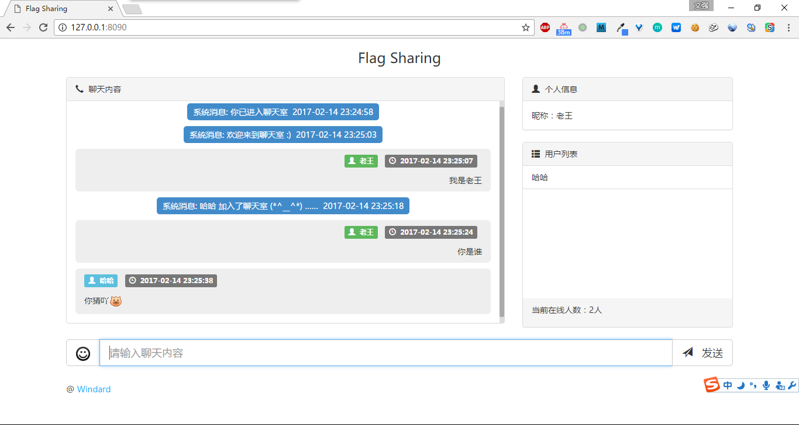
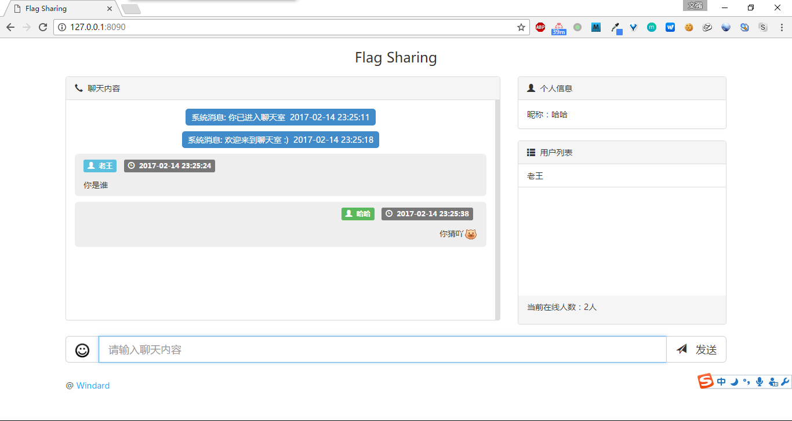

## flagsharing

### node 版本

```
npm install -g cnpm --registry=https://registry.npm.taobao.org
cnpm install
cnpm start
```

使用 socket.io 实现 websocket ，使用 xss-escape 实现 XSS 过滤。

node 版本加上了 历史记录 的功能，使用 `curl http://127.0.0.1:3000/history` 即可在命令行中查看，这也就需要先配置 MySQL 数据库，或者去掉该功能。

### Python 版本

```
pip install -r requirements.txt -i http://pypi.douban.com/simple --trusted-host pypi.douban.com
python index.py
```

使用 tornado.websocket 库实现 websocket，使用 bleach 实现 XSS 过滤。

在使用 Python 版本的时候， websocket 之间的通信使用 `tornado.websocket.WebSocketHandler.write_message` 来发送消息，在注释中是写着可以使用字符串或者字典的，如果使用字典的话将自动转化为 json 格式。

```
write_message(self, message, binary=False) unbound tornado.websocket.WebSocketHandler method
    Sends the given message to the client of this Web Socket.

    The message may be either a string or a dict (which will be
    encoded as json).  If the ``binary`` argument is false, the
    message will be sent as utf8; in binary mode any byte string
    is allowed.

    If the connection is already closed, raises `WebSocketClosedError`.

```

但是在实际发送的时候却报错了，显示只能是字符串，而不能是字典。。。这就很尴尬了。

```
ERROR:tornado.application:Uncaught exception in /websocket
Traceback (most recent call last):
  File "C:\Python27\lib\site-packages\tornado\websocket.py", line 417, in _run_callback
    callback(*args, **kwargs)
  File "index.py", line 30, in open
    self.write_message(['needNickname'])
  File "C:\Python27\lib\site-packages\tornado\websocket.py", line 218, in write_message
    return self.ws_connection.write_message(message, binary=binary)
  File "C:\Python27\lib\site-packages\tornado\websocket.py", line 686, in write_message
    message = tornado.escape.utf8(message)
  File "C:\Python27\lib\site-packages\tornado\escape.py", line 203, in utf8
    "Expected bytes, unicode, or None; got %r" % type(value)
TypeError: Expected bytes, unicode, or None; got <type 'list'>
```

如果能使用字典的话，那么在发送一次多条消息的时候可以自由截断，而只能使用字符串的话，无论怎么截断都会有一定的问题，特别是截断符的选择。

所以最后还是自己进行 json 转码发送，在 Python 端使用 json 库进行 json 与字符串之间的转化，使用 JSON.parse 和 JSON.stringify 来进行客户端之间的转化。

### 效果



